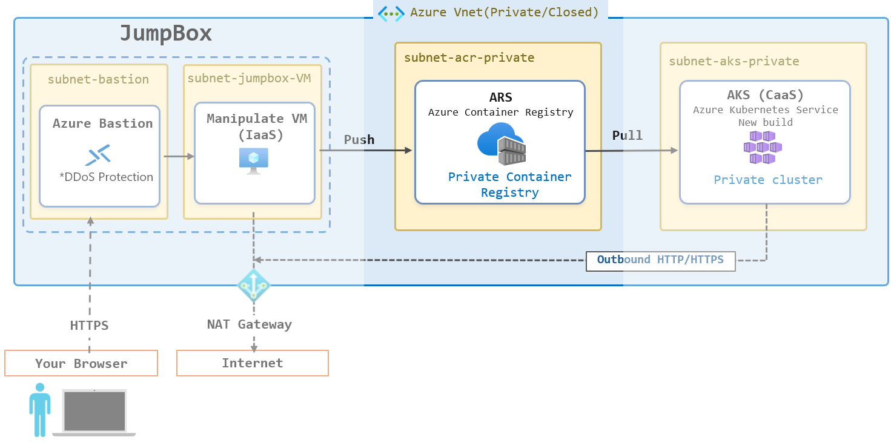

\[[In English](#build-a-private-azure-container-registry-acr-in-an-azure-virtual-network)\]

# Azure の仮想ネットワークに閉域化された Azure Container Registry (ACR) を構築する

Azure の仮想ネットワークのリソースにのみサービスを提供する [Azure Container Registry (ACR)](https://learn.microsoft.com/ja-jp/azure/container-registry/container-registry-intro) を構築するための手順を説明します。

この手順で構築された ACR は、インターネットから直接アクセスできないように閉域化されます。これにより、セキュリティが強化され、仮想ネットワーク内のリソースのみにサービスを提供する完全なプライベートなコンテナレジストリとして機能します。

# 概要

オンプレミス環境から運用中のシステムを Microsoft Azure に移行する際、多くの場合、セキュリティの観点からインターネットに直接接続できない閉域化された環境での運用が求められます。Azure Container Registry (ACR) は、オープンソースの [Docker プラットフォーム](https://docs.docker.com/get-started/docker-overview/)に基づくマネージドなコンテナレジストリを提供するサービスであり、仮想ネットワーク内での閉域化された構成をサポートしています。

この手順ではすでに [Azure 上に仮想ネットワークと Jump Box (踏み台サーバー) が構築されている](https://github.com/osamum/HowtoMake-Az-JumpBox-Env)ことを前提とし、その既存の仮想ネットワーク内に Azure Container Registry を構築する方法を説明します。

 

# 前提条件

この手順を実施する前に、以下の前提条件を満たしている必要があります。

* Azure サブスクリプションが有効であること
* Azure ポータルにアクセスできること
* Azure の管理者権限か共同作成者の権限を持っていること
* 以下の手順で構築された仮想ネットワークと Jump Box が存在すること
  - [Azure の仮想ネットワークで閉域化された環境に安全にアクセスするための Jump Box 環境の構築](https://github.com/osamum/HowtoMake-Az-JumpBox-Env)

# 手順

1. [既存の Azure 仮想ネットワークに ACR 用のサブネットを作成](jp-ex01.md)
2. [閉域環境への ACR のデプロイ](jp-ex02.md)
3. [Jump Box から ACR へのサインインとイメージの Push](jp-ex03.md)

 

# Build a Private Azure Container Registry (ACR) in an Azure Virtual Network

This guide explains how to build an [Azure Container Registry (ACR)](https://learn.microsoft.com/en-us/azure/container-registry/container-registry-intro) that provides services only to resources within an Azure virtual network.

The ACR created by following this guide is isolated from direct internet access. This enhances security and allows it to function as a fully private container registry that serves only resources within the virtual network.

# Overview

When migrating a production system from an on-premises environment to Microsoft Azure, security requirements often call for an isolated environment without direct internet access. Azure Container Registry (ACR) is a service that provides a managed container registry based on the open-source [Docker platform](https://docs.docker.com/get-started/docker-overview/) and supports private configurations within a virtual network.

This guide assumes that [a virtual network and a jump box have already been deployed in Azure](https://github.com/osamum/HowtoMake-Az-JumpBox-Env) and explains how to deploy Azure Container Registry within that existing virtual network.

 

# Prerequisites

Before following this guide, ensure that the following prerequisites are met:

* You have an active Azure subscription.
* You can access the Azure portal.
* You have the Owner or Contributor role in Azure.
* A virtual network and jump box created by following the guide below are available.
  - [Build a Jump Box Environment for Secure Access to an Isolated Azure Virtual Network](https://github.com/osamum/HowtoMake-Az-JumpBox-Env)

# Steps

1. [Create a Subnet for ACR in an Existing Azure Virtual Network](en-ex01.md)
2. [Deploy ACR in a Private Environment](en-ex02.md)
3. [Sign In to ACR and Push an Image from the Jump Box](en-ex03.md)

 