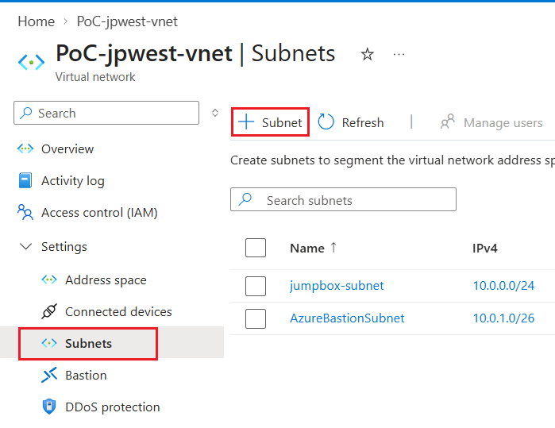
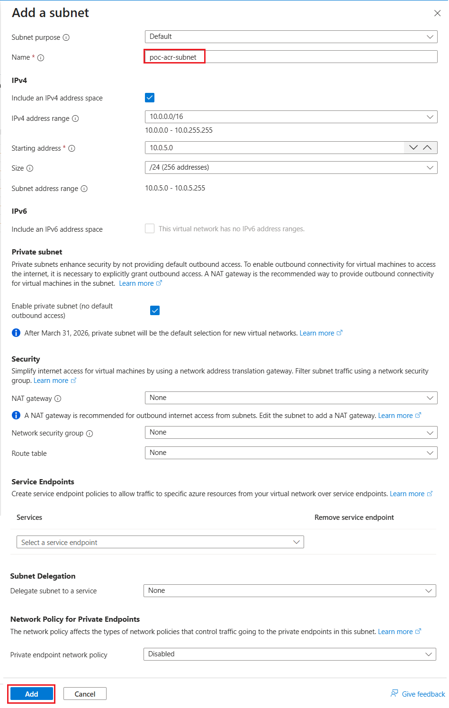

# Step 1: Create a Subnet for ACR in an Existing Azure Virtual Network

In this step, you create a subnet for Azure Container Registry (ACR) in an existing Azure virtual network. ACR must operate within a dedicated subnet.

This guide assumes that a virtual network and Jump Box have already been created by following the guide below. Complete that guide before proceeding.

* [**Build a Jump Box environment for secure access to an isolated Azure virtual network**](https://github.com/osamum/HowtoMake-Az-JumpBox-Env)

Follow these steps to create a subnet for ACR in the existing Azure virtual network.

\[**Steps**▶️\]

1. In the [Azure portal](https://portal.azure.com/), open the page for the target virtual network.

2. From the menu on the left, select \[Settings\] - \[**Subnets**\], and then select \[**+ Subnet**\] from the menu at the top of the page.

   

3. The \[**Add subnet**\] pane appears on the left. Configure each setting as follows.

    |Setting|Value|
    |:---|:---|
    |Subnet purpose|Default|
    |Name \*|`poc-acr-subnet`|
    |Include an IPv4 address space|**Selected**|
    |IPv4 address range|(Keep the default value)|
    |Starting address \*|(Keep the default value)|
    |Size|(Keep the default value)|
    |Include an IPv6 address space|Not selected|
    |Enable private subnet (no default outbound access)|Selected|
    |NAT gateway|None|
    |Network security group|None|
    |Route table|None|
    |Service endpoints|Do not specify|
    |Subnet delegation|None|
    |Private endpoint network policy|Disabled|

    

    After configuring the settings, select \[**Add**\] at the bottom of the pane to create the subnet.

You have now added a subnet for ACR to the existing virtual network.

 

## Next

👉 [**Step 2: Deploy ACR in a Private Network Environment**](en-ex02.md)

---

🏚️ [Back to README](README.md)
