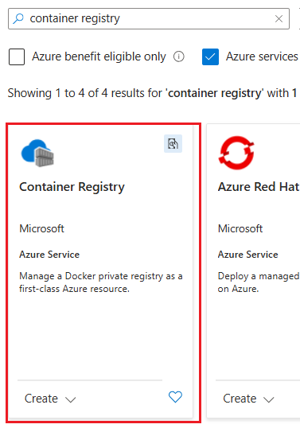
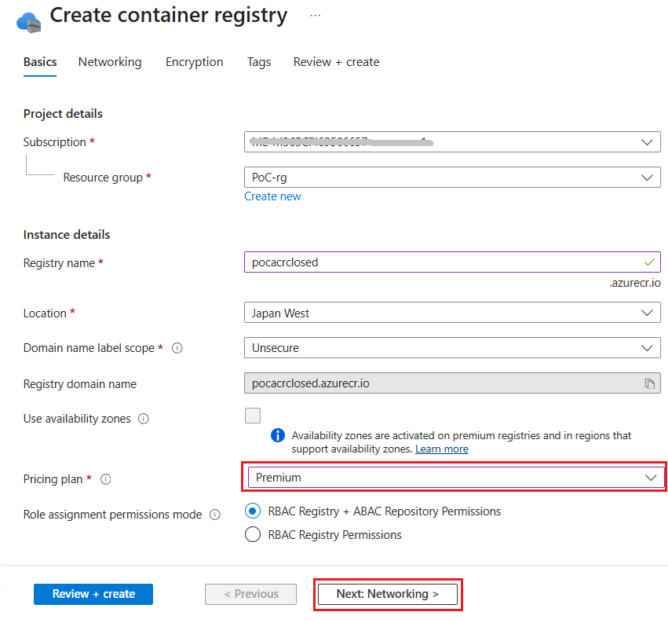
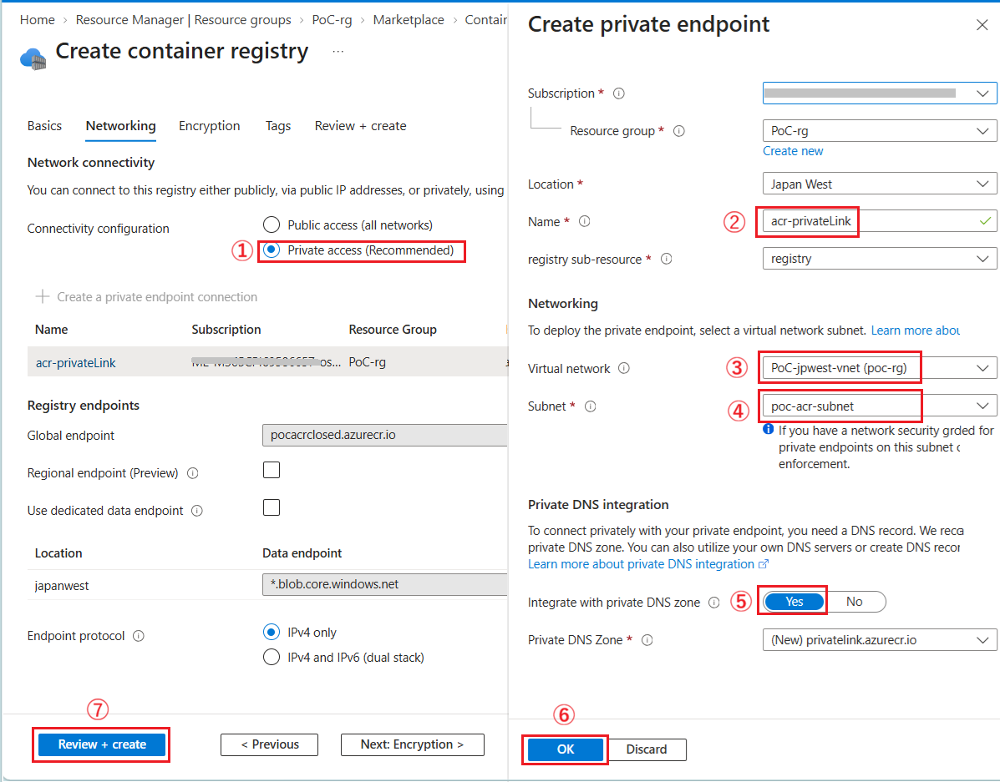

# 手順 2 : 閉域環境への ACR のデプロイ

この手順では、既存の Azure 仮想ネットワークに Azure Container Registry (ACR) をデプロイします。

この手順でデプロイされる ACR は、デプロイされた仮想ネットワーク上にある Jump Box 経由でないと操作が行えないので注意が必要です。

\[**手順**▶️\]

1. [Azure Portal](http://portal.azure.com) にログインし、ポータル画面上部の \[**+**\] リソースの作成アイコンをクリックします。アイコンが表示されていない場合は、画面左上のハンバーガーメニューをクリックし、\[**リソースの作成**\] をクリックします

    

2. \[**リソースの作成**\] 画面に遷移するので、検索ボックスに `Container Registry` と入力し、表示された検索結果の \[**Container Registry**\] のタイルをクリックします

    

3. \[**Container Registry**\] の画面に遷移するので、\[**作成**\] ボタンをクリックします

4. \[**コンテナー レジストリの作成**\] の画面の \[**基本**\] タブに遷移するので、各項目を以下のように設定します

    **プロジェクトの詳細**

    |項目|設定値|
    |:---|:---|
    |サブスクリプション \*|使用するサブスクリプション|
    |リソース グループ|\[*任意のリソースグループ*\]|

    **インスタンスの詳細**

    |項目|設定値|
    |:---|:---|
    |レジストリ名 \*|`pocacrpriv<ユニークな値>`|
    |場所 \*|\[**(Asia Pacific) Japan West**\]|
    |ドメイン名ラベルのスコープ \*|\[**セキュリティ保護なし**\]|
    |可用性ゾーンを使用する|チェックしない|
    |価格プラン \*|\[**Premium**\](※1)|
    |ロールの割り当てアクセス許可モード|\[**RBAC レジストリのアクセス許可**\]にチェック(※2)|
    
    

    (※1) 仮想ネットワーク内へのプライベート エンドポイントを公開するには Premium プランが必要です。
    
    (※2) 将来的には `RBAC レジストリ + ABAC リポジトリのアクセス許可` が既定になる予定ですが、今回は学習用に手順を簡略化するため、`RBAC レジストリのアクセス許可` を選択します。実際の運用環境では、要件に応じて適切な構成を選択してください。

    設定が完了したら、画面下部の \[**次へ: ネットワーク**\] ボタンをクリックします

5. **ネットワーク**　画面に遷移するので、\[**接続の構成**\] で、\[**プライベート アクセス (推奨)**\] オプションボタンにチェックをつけ、\[**+ プライベート エンドポイント接続を作成します**\] をクリックします

6. 画面右に \[**プライベート エンドポイントの作成**\] ブレードが表示されるので、各項目を以下のように設定します。

    |項目|設定値|
    |:---|:---|
    |サブスクリプション \*|使用するサブスクリプション|
    |リソース グループ|\[*任意のリソースグループ*\]|
    |場所 \*|\[**(Asia Pacific) Japan West**\]|
    |名前 \*|`acr-privateLink`|
    |レジストリ サブリソース \*|registry|

    **仮想ネットワーク**

    |項目|設定値|
    |:---|:---|
    |仮想ネットワーク|\[**PoC-jpwest-vnet**\]|
    |サブネット \*|\[**poc-acr-subnet**\]|

    **プライベート DNS 統合**

    |項目|設定値|
    |:---|:---|
    |プライベート DNS ゾーンと統合する|\[**はい**\]|
    |プライベート DNS ゾーン \*|*既定のもの*|

    各項目の設定が完了したら \[OK\] ボタンをクリックします。

7. もとの **コンテナー レジストリの作成** 画面に戻るので、他の項目の設定は既定のまま画面下部の \[**確認および作成**\] ボタンをクリックします

    
 
    \[**作成**\] ボタンが表示されたらクリックして ACR のデプロイを開始します。

ここまでの手順で閉域環境への Azure Container Registry (ACR) のデプロイが完了しました。デプロイの完了までには数分かかる場合がありますので、しばらく待ってから次の手順に進んでください。

 

## 次へ

👉 [手順 3: Jump Box から ACR へのサインインとイメージの Push](jp-ex03.md)

👈 [手順 1 : 既存の Azure 仮想ネットワークに ACR 用のサブネットを作成](jp-ex01.md)

---

🏚️　[README に戻る](README.md)