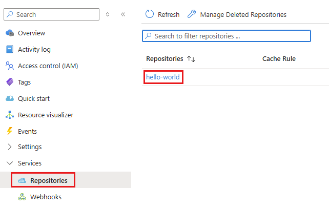

# 手順 3: Jump Box から ACR へのサインインとイメージの Push

閉域化環境にデプロイされた Azure Container Registry (ACR) に同じ仮想ネットワーク上にある Jump Box マシンから接続します。

この作業を実施する前に Jump Box 側での準備が必要になります。

## 準備

ACR にサインインするためのコマンド `az acr login` を実行するには、実行するマシン上に Docker CLI と Docker daemon の両方が必要になるため、Jump Box マシンに Docker のインストールが必要になります。

[Docker Desktop](https://docs.docker.com/desktop/setup/install/windows-install/) のライセンスの有償、無償の条件を確認し、使用可能である場合は Jump Box マシンに [Docker Desktop](https://docs.docker.com/desktop/setup/install/windows-install/) をインストールして使用することができるので、リンク先の案内に従って[インストール](https://docs.docker.com/desktop/setup/install/windows-install/#install-docker-desktop-on-windows)を行い、Docker サービスを起動してください。

Docker Desktop が使用できる場合は、次の手順はスキップして [ACR にログインしてイメージを push する](#acr-%E3%81%AB%E3%83%AD%E3%82%B0%E3%82%A4%E3%83%B3%E3%81%97%E3%81%A6%E3%82%A4%E3%83%A1%E3%83%BC%E3%82%B8%E3%82%92-push-%E3%81%99%E3%82%8B) に進んでください。

### Docker Desktop が使用できない場合

ライセンス等の関係で Docker Desktop が使用できない場合は、[Windows Subsystem for Linux (WSL)](https://learn.microsoft.com/ja-jp/windows/wsl/) をインストールし、そこに Docker Engine をインストールして Docker daemon を動かします。

具体的な手順は以下のとおりです。

\[**手順**▶️\]

1. Bastion を使用して Jump Box マシンにログインし、ターミナル画面を起動します

2. 以下のコマンドを実行し、[入れ子になった仮想化(Nested-Virtualization)](https://learn.microsoft.com/windows-server/virtualization/hyper-v/enable-nested-virtualization) が使用できるか確認します

    ```
    Get-ComputerInfo -Property HyperV*
    ```
    結果に `HyperVisorPresent : True` と返れば Hyper-V が使用できるので問題ありません。もし、`False` の場合はここで作業を中断し、Jump Box の仮想マシンのサイズを `Standard D2lds v5` などに変更してください。
   
3. WSL コマンドをインストールします
   
   ```
   wsl --install
   ```

4. Linux ディストリビューションとして Ubuntu をインストールします

    ```
    wsl --install -d Ubuntu
    ```
    
    インストール時に、管理者パスワードを求められるので設定してください。

    インストールが完了したらターミナル ウィンドウを閉じて、再度起動します。

5. 以下のコマンドを実行してプロンプトが切り替わることを確認します

    ```
    bash
    ```
    
    もし切り替わらない場合は、Jump Box マシンを再起動します

6. ターミナル画面が bash で動作している状態で、WSL 側に Azure CLI をインストールします

    以下の[コマンド](https://learn.microsoft.com/cli/azure/install-azure-cli-linux?view=azure-cli-latest&pivots=apt#option-1-install-with-one-command)を実行します。

    ```
    curl -fsSL 'https://azurecliprod.blob.core.windows.net/$root/deb_install.sh' | sudo bash
    ```
    インストールが完了したらターミナル画面を再起動してプロンプトを Bash に切り替え、以下のコマンドを実行します。

    ```
    which az
    ```

    `/usr/bin/az` と返ることを確認します。

7. WSL に Docker Engine をインストールします

    Docker Engine のインストール方法はいくつかありますが、ここでは Docker 公式のドキュメントが紹介している[インストールスクリプトを使用する方法](https://docs.docker.com/engine/install/ubuntu/#install-using-the-convenience-script)でインストールを行います。

    以下のコマンドを実行して Docker Engine をインストールします

    ```
    curl -fsSL https://get.docker.com -o get-docker.sh
    sudo sh get-docker.sh
    ```
    続けて、以下のドキュメントの**ステップ 3 まで**を実行します。

    * [**Manage Docker as a non-root user**](https://docs.docker.com/engine/install/linux-postinstall/)
    
8. ターミナル画面のプロンプトが Bash であることを確認し、以下のコマンドで Azure にログインします

    ```
    az login
    ```
    
    正常にログインできることを確認します。

ここまでの手順で、Azure Container Registry (ACR) にログインする準備ができました。

<br>

## ACR にログインしてイメージを push する

Jump Box のターミナル画面から Azure Container Registry (ACR) にログインし、サンプルのコンテナ イメージを push します。

具体的な手順は以下のとおりです。

\[**手順**▶️\]

1. Azure Container Registry (ACR) にログインします

    ```
    az acr login --name <ACR_NAME>
    ```

2. Microsoft Container Registry から hello-world イメージを pull します

    ```
    docker pull mcr.microsoft.com/hello-world:latest
    ```

3. pull したイメージを列挙して確認します

    ```
    docker images   
    ```
4. イメージをレジストリにプッシュする前に、レジストリ ログイン サーバーの完全修飾名を持つ [docker tag](https://docs.docker.com/engine/reference/commandline/tag/) コマンドを使用して、イメージにタグ付けを行います

    この手順では、ACR をデプロイする際の \[ドメイン名ラベルのスコープ\] 設定で `セキュリティ保護なし` を選択しているので、以下のようにタグを付けます。

    ```
    docker tag mcr.microsoft.com/hello-world:latest <ACR_NAME>.azurecr.io/hello-world:v1
    ```
5. [docker push](https://docs.docker.com/engine/reference/commandline/push/) コマンドを使用して、レジストリ インスタンスにイメージをプッシュします。この例では、hello-world レポジトリを作成します。これには、hello-world:v1 イメージが含まれています

    ```
    docker push <ACR_NAME>.azurecr.io/hello-world:v1
    ```

6. push が完了したら Jump Box の Web ブラウザーから Azure Portal にアクセスし、ACR のリポジトリに hello-world:v1 イメージが存在することを確認します。

    

    もし、Jump Box からアクセスしたにもかかわらず、リポジトリの一覧の表示でエラーが出る場合は、対象の ACR インスタンスの \[Access control (IAM)\] で現在使用しているアカウントに以下のロールを付与してみてください。

    * `Container Registry Repository Catalog Lister`
    * `Container Registry Repository Contributor`

ここまでの手順で、デプロイした ACR にログインしコンテナ イメージをプッシュすることができました。

なお、より詳細な方法については以下のドキュメントを参照してください。

* [**クイック スタート: Azure portal を使用して Azure コンテナー レジストリを作成する**](https://learn.microsoft.com/ja-jp/azure/container-registry/container-registry-get-started-portal?tabs=azure-cli)

<br>

👈 [**手順 2 : 閉域環境への ACR のデプロイ**](jp-ex02.md)

---

🏚️　[README に戻る](README.md)